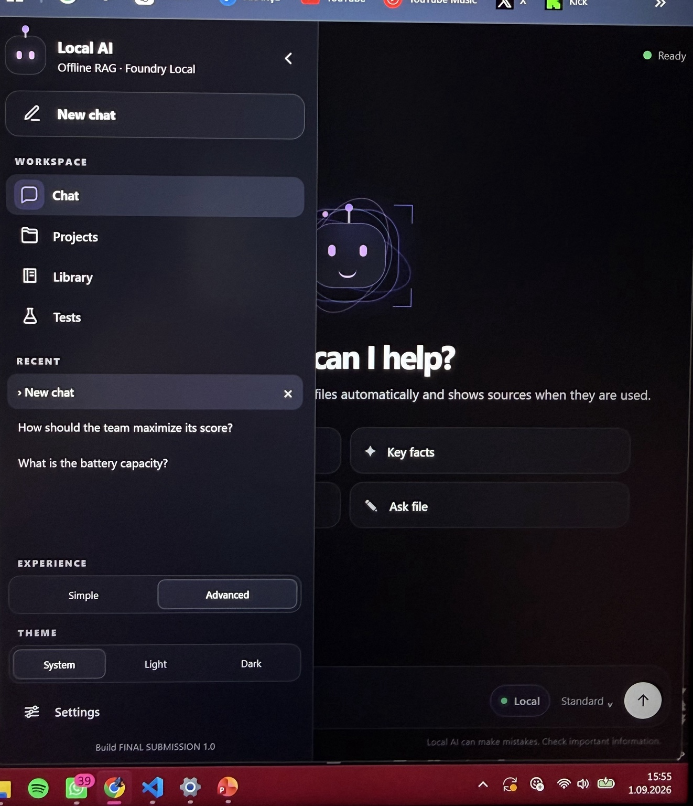
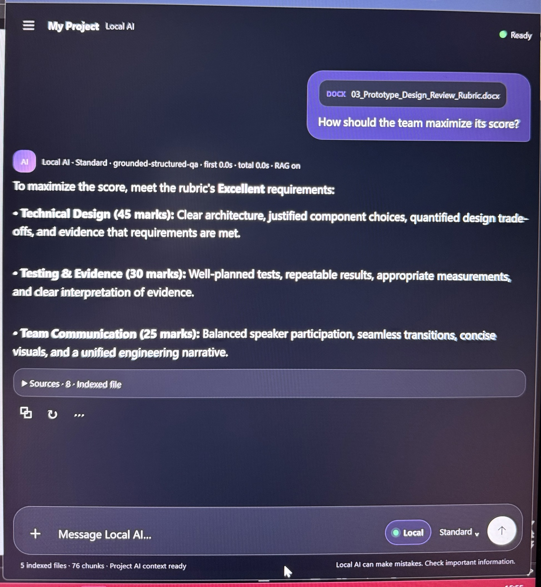

# Local RAG AI Assistant with Microsoft Foundry Local

**Presented by:** Azra Simay Yıldız  
**Programme:** Electronic and Computer Engineering  
**University:** University of Kent

A fully local document question-answering assistant built with **Microsoft Foundry Local**, **Retrieval-Augmented Generation (RAG)**, **text embeddings**, **cosine-similarity retrieval**, and **SQLite**.

The project follows the supplied *One-Month Project Plan: Local RAG AI Assistant with Microsoft Foundry Local*. Its core purpose is to answer questions from a small local document collection while keeping inference, retrieval, storage, and files on the user's device.

## Key features

- Local Q&A over **PDF, DOCX, and TXT** documents.
- Microsoft Foundry Local for on-device chat inference and embedding generation.
- Automatic ingestion after upload: parse → chunk → embed → store in SQLite.
- SQLite-backed local knowledge base containing document chunks, embeddings, source/page information, and structural metadata.
- Hybrid retrieval that combines embedding similarity, lexical matching, and document structure.
- Strict grounding: if the active file does not contain the requested information, the assistant returns a clear "not provided" response instead of guessing.
- Source cards showing the supporting file, page when available, and chunk.
- Whole-document actions: **Summarize**, **Key Facts**, **Explain**, and **Ask File**.
- Active-file scoping: the most recently selected/uploaded file is used unless the user explicitly requests multiple/all files.
- English/Turkish cross-language retrieval for common document questions.
- Built-in evaluation screen for answerable, unanswerable, and edge-case tests.
- Offline-only application code: **no external web-search implementation is shipped**.

## Architecture

The targeted Q&A path is:

1. Read a local PDF/DOCX/TXT document.
2. Build clean logical records and passage chunks.
3. Generate an embedding for each chunk with Foundry Local.
4. Store chunk text, metadata, and embeddings in the project's SQLite database.
5. Embed the user's query with the same embedding model.
6. Retrieve relevant evidence with cosine similarity plus lexical/structural scoring.
7. Send only the selected evidence and the question to the local Foundry Local chat model.
8. Return a grounded answer with source cards.

Whole-document requests such as *Summarize* and *What is this document about?* use a bounded ordered view of the active document rather than semantic top-k retrieval, because a summary needs broad document coverage.

See `ARCHITECTURE.md` for more detail.

## Local models

- **Standard chat:** `qwen2.5-1.5b`
- **Advanced chat (optional):** `phi-4-mini`
- **Embeddings:** `qwen3-embedding-0.6b`

The application talks to the **local Foundry Local OpenAI-compatible endpoint on localhost**. The Foundry Local runtime performs the actual on-device model execution.

## One-time setup

The first setup requires Internet access only to install packages / download model files. After the models are cached, the core assistant is designed to run without Internet access.

### Windows

1. Install Python 3.11+.
2. Install Microsoft Foundry Local / Foundry CLI using the official Microsoft instructions referenced by the project brief.
3. Extract this ZIP and open the folder in VS Code.
4. Run either:

```powershell
install_and_setup.bat
```

or manually:

```powershell
python -m pip install -r requirements.txt
python setup_models.py
python app.py
```

5. Open:

```text
http://127.0.0.1:8501
```

For later runs, use `start.bat` or `python app.py`.

### macOS / Linux

The Python application is cross-platform and the requirements file uses platform-specific Foundry SDK markers. Install Foundry Local for the operating system first, then run:

```bash
python3 -m pip install -r requirements.txt
python3 setup_models.py
python3 app.py
```

or use `setup.sh` once and `start.sh` afterwards.

**Validation note:** the final application was developed and runtime-tested on the target Windows environment. macOS-specific runtime execution was not available in the build container, so macOS instructions are provided but not claimed as runtime-verified here.

## How to use

1. Start the application.
2. Create/open a project.
3. Upload one or more PDF, DOCX, or TXT files.
4. Wait until the file shows as indexed.
5. Ask a question normally, or use **Summarize**, **Key Facts**, **Explain**, or **Ask File**.
6. Expand **Sources** under an answer to inspect the retrieved evidence.
7. Use the **Tests** page to run answerable/unanswerable checks.

## RAG and grounding behavior

For targeted factual questions, the model is not treated as the source of truth. Evidence is selected first from the local index. High-confidence values such as marks, ranges, form fields, table values, and direct facts may be answered deterministically. Supported synthesis is used when multiple pieces of evidence must be combined. If the evidence is insufficient, the assistant returns a localized fallback rather than inventing a fact.

## Data and privacy

- Project files stay in the local `projects/` directory.
- Embeddings and chunks are stored in a local SQLite database inside the project workspace.
- Chat inference and embeddings use the local Foundry Local runtime.
- The final application contains no Google/Bing/DuckDuckGo/Wikipedia search code and does not send queries to an external search service.
- Model download/package installation during one-time setup can require Internet access.

## Testing

The project includes:

- `TEST_PLAN.md` — required functional and edge-case test plan.
- `TEST_RESULTS.md` — recorded static/parser/regression results and the runtime-test limitation.
- `demo_documents/` — a five-document mixed-format demo corpus.
- `demo_documents/TEST_QUESTIONS_AND_EXPECTED.txt` — repeatable demo questions and expected facts.
- `verify_project.py` — static submission validation.

Run the static validation with:

```bash
python verify_project.py
```

The in-app **Tests** page also measures retrieval/generation timing for the active project.

## Design decisions

- **SQLite** was chosen because it is serverless, self-contained, local, cross-platform, and sufficient for the small document collections described in the brief.
- **Cosine similarity** is used for semantic retrieval over embeddings.
- **Hybrid retrieval** adds lexical and structural matching because exact fields, marks, table headers, and numbered questions are often better served by structure than by semantic similarity alone.
- **Active-file scope** avoids accidental answers from unrelated project documents.
- **Whole-document routing** prevents summary requests from being reduced to only a few semantically similar chunks.
- **No live web search** keeps the core architecture aligned with the offline project goal.

## Known limitations

- Image-only/scanned PDFs are not OCR'd by this build; selectable text is required.
- Highly visual diagrams, handwriting, and unusual equation layouts may not be fully represented by text extraction.
- No document-Q&A system can guarantee perfect answers for every possible layout; the application therefore prefers a safe "not provided" response over unsupported guessing.
- Very large documents are bounded before whole-document generation to keep local-model latency practical.
- macOS runtime behavior was not directly tested in the build environment.

## Final demo

Use `FINAL_DEMO_GUIDE.md` for the recommended presentation structure. The demo should show:

1. the problem and offline architecture,
2. document upload/indexing,
3. an answerable grounded question with Sources,
4. an unanswerable question that returns "not provided",
5. a short explanation of SQLite, embeddings, retrieval, and Foundry Local,
6. lessons learned / limitations.

## References from the supplied project brief

- Microsoft Tech Community — **Building Your First Local RAG Application with Foundry Local**: https://techcommunity.microsoft.com/blog/azuredevcommunityblog/building-your-first-local-rag-application-with-foundry-local/4501968
- Microsoft Learn — **What is Foundry Local?** (official documentation referenced by the brief)
- Microsoft Learn — **Get started with Foundry Local** (official guide referenced by the brief)
- Microsoft Learn — **Tutorial: Build a RAG application** (official tutorial referenced by the brief)
- Microsoft Learn — **Prompt engineering techniques** (official guidance referenced by the brief)
- SQLite documentation / Microsoft Windows App Development documentation on local SQLite storage (referenced by the brief)

## Submission files

- `app.py` — FastAPI application and RAG pipeline
- `native_foundry.py` — Foundry Local runtime integration helper
- `setup_models.py` — one-time local model preparation
- `requirements.txt` — dependencies
- `static/` — local web UI
- `ARCHITECTURE.md` — architecture and design rationale
- `TEST_PLAN.md` / `TEST_RESULTS.md` — testing evidence
- `FINAL_DEMO_GUIDE.md` — presentation/demo plan
- `SUBMISSION_CHECKLIST.md` — brief-to-project requirement mapping
- `demo_documents/` — five-document demo corpus

## Application Screenshots

### Local workspace and project context



### Grounded answer with source evidence



## Presentation

The final presentation deck is included at:

`presentation/Local_RAG_AI_Assistant_Azra_Simay_Yildiz_PRO.pptx`

